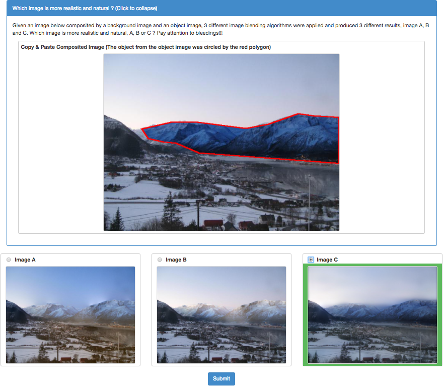

# GP-GAN: Towards Realistic High-Resolution Image Blending
[[Project]](https://wuhuikai.github.io/GP-GAN-Project/)   [[Paper]](https://arxiv.org/abs/1703.07195)  
Official Chainer implementation of GP-GAN: Towards Realistic High-Resolution Image Blending

## Overview

| source | destination | mask | composited | blended |
| --- | --- | --- | --- | --- |
|  |  |  |  |  |

GP-GAN (aka. Gaussian-Poisson GAN) is the author's implementation of the high-resolution image blending algorithm described in:  
"GP-GAN: Towards Realistic High-Resolution Image Blending"   
Huikai Wu, Shuai Zheng, Junge Zhang, Kaiqi Huang

Given a source image, a destination image and a mask, our algorithm could blend the two images given the mask and generate high-resolution and realsitic results. Our algorithm is based on deep generative models such as [Wasserstein GAN](https://arxiv.org/abs/1701.07875).

Contact: Hui-Kai Wu (huikaiwu@icloud.com)

## Getting started
* Install the python libraries. (See `Requirements`).
* Download the code from GitHub:
```bash
git clone https://github.com/wuhuikai/GP-GAN.git
cd GP-GAN
```
* Download the pretrained models `blending_gan.npz` and `unsupervised_blending_gan.npz` from [Google Drive](https://drive.google.com/open?id=0Bybnpq8dvwudVjBHNWNHUmVSV28), then put them in `models`.

* Run the python script:
``` bash
python run_gp_gan.py --src_image images/test_images/src.jpg --dst_image images/test_images/dst.jpg --mask_image images/test_images/mask.png --blended_image images/test_images/result.png
```

## Results compared with baseline methods

| Mask | Copy-and-Paste | Modified-Poisson | Multi-splines | Supervised GP-GAN | Unsupervised GP-GAN |
| --- | --- | --- | --- | --- | --- |
|  |  |  |  |  |  |
|  |  |  |  |  |  |
|  |  |  |  |  |  |
|  |  |  |  |  |  |
|  |  |  |  |  |  |

## Requirements
The code is written in Python3.5 and requires the following 3rd party libraries:
* scipy
* numpy
* [fuel](http://fuel.readthedocs.io/en/latest/index.html)
```bash
pip install git+git://github.com/mila-udem/fuel.git
```
Details see the official [README](http://fuel.readthedocs.io/en/latest/setup.html) for installing fuel.
* [skimage](http://scikit-image.org/)
```bash
pip install scikit-image
```
Details see the official [README](https://github.com/scikit-image/scikit-image) for installing skimage.
* [Chainer](http://chainer.org/)
```bash
pip install chainer
```
Details see the official [README](https://github.com/pfnet/chainer) for installing Chainer. **NOTE**: All experiments are tested with Chainer 1.22.0. It should work well with Chainer 1.**.* without any change.
## Command line arguments:
Type `python run_gp_gan.py --help` for a complete list of the arguments.
* `--supervised`: use unsupervised Blending GAN if set to False
* `--list_path`: process batch of images according to the list

## Step by step from scratch
### Training Blending GAN
* Download Transient Attributes Dataset, see [the project website](http://transattr.cs.brown.edu/) for more details.
* Crop the images in each subfolder:
```bash
python crop_aligned_images.py --data_root [Path for imageAlignedLD in Transient Attributes Dataset]
```
* Train Blending GAN:
```bash
python train_blending_gan.py --data_root [Path for cropped aligned images of Transient Attributes Dataset]
```
* Training Curve


* Result

| Training Set | Validation Set |
| --- | --- |
|  |  |

### Training Unsupervised Blending GAN
* Download the hdf5 dataset of outdoor natural images: [ourdoor_64.hdf5](https://people.eecs.berkeley.edu/~junyanz/projects/gvm/datasets/outdoor_64.zip) (1.4G), which contains 150K landscape images from MIT [Places](http://places.csail.mit.edu/) dataset. 
* Train unsupervised Blending GAN:
```bash
python train_wasserstein_gan.py --data_root [Path for outdoor_64.hdf5]
```
* Training Curve

* Samples after training

  

**NOTE:** Type `python [SCRIPT_NAME].py --help` for more details about the arguments.

## Object-level annotation for Transient Attributes Dataset (used for mask images)
* The folder name on [LabelMe](http://labelme.csail.mit.edu/Release3.0/) is `/transient_attributes_101`
* The processed masks are in the folder [`mask`](mask) on this repository
* Coresponding scripts for processing raw xmls from `LabelMe` are also in the folder [`mask`](mask)

## Evaluate blended results using RealismCNN
### Get pretrained realismCNN
Download pretrained [caffe model](http://www.eecs.berkeley.edu/~junyanz/projects/realism/realismCNN_models.zip) and transform it to Chainer model:
```bash
python load_caffe_model.py
```
**Or**
Download pretrained [Chainer model](https://drive.google.com/open?id=0Bybnpq8dvwudVjBHNWNHUmVSV28) directly.
### Evalute the blended images
```bash
python predict_realism.py --list_path [List File]
```

## User Study
### Set up image server
* Install lighttgb:
```bash
sudo apt-get install lighttpd
```
* Start server by running the script in folder [`user_study`](user_study):
```bash
sh light_tpd_server.sh [Image Folder] [Port]
```
### Template for user study
See [`user_study.html`] in folder [`user_study`](user_study) for details.



## Baseline Methods
Code for baseline methods can be downloaded from [here](http://cg.cs.tsinghua.edu.cn/blending/).

Also, the modified code for baseline methods is in folder [`Baseline`](Baseline).

## TODO
- [ ] Experiment with more gradient operators like [Sobel](https://en.wikipedia.org/wiki/Sobel_operator) or egde detectors like [Canny](https://en.wikipedia.org/wiki/Canny_edge_detector).
- [ ] Add more constraints for optimizing `z` vector like [Perception Loss](http://cs.stanford.edu/people/jcjohns/eccv16/).
- [ ] Try different losses like [CNN-MRF](https://github.com/chuanli11/CNNMRF).

## Citation
```
@article{wu2017gp,
  title={GP-GAN: Towards Realistic High-Resolution Image Blending},
  author={Wu, Huikai and Zheng, Shuai and Zhang, Junge and Huang, Kaiqi},
  journal={arXiv preprint arXiv:1703.07195},
  year={2017}
}
```
